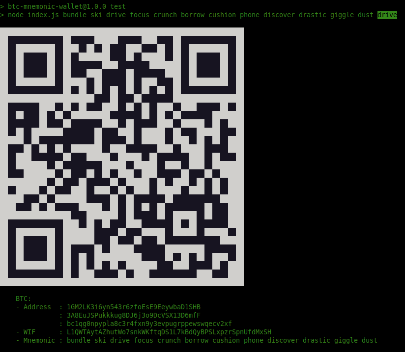

JavaScript bitcoin mnemonic wallet generator with QR-coded private key of Bech32 (SegWit native).
===

Run:

    npm install
    npm test

Examples:

    npm test [mnemonic..12]
    npm test [mnemonic..12] [passphrase]

Screenshot
---

Links
---

- [What Is A Bitcoin Derivation Path?](https://thebitcoinmanual.com/articles/btc-derivation-path/)
- [How to generate a new Bitcoin address in JavaScript](https://www.quicknode.com/guides/web3-sdks/how-to-generate-a-new-bitcoin-address-in-javascript)
- [BitcoinJS (tests and examples)](https://github.com/bitcoinjs/bitcoinjs-lib/blob/master/test/integration/addresses.spec.ts)

Changelog
---

**20-06-2024**

- HD Wallet (P2PKH, P2SH, Bech32)
- Passphrase ("13-th word")
- [Screenshot](wallet.png) of test wallet with "drive" passphrase

**30-04-2023**

- Upload to [GitHub](https://github.com/s1doryak/wallet)
- [Screenshot](wallet.png) of test wallet

**20-02-2023**

- Init (ref: [javascript.plainenglish.io](https://javascript.plainenglish.io/generate-your-own-bitcoin-wallet-within-5-minutes-3c36176b47ee))
- Fix BIP32 version (ref: [gist.github.com](https://gist.github.com/PraneshASP/df3f3f0af02fea728ad49bfa0cae7aff?permalink_comment_id=4080906#gistcomment-4080906))
- QR-code terminal implementation

Thanks
---

- [BIP39](https://www.npmjs.com/package/bip39)

Contributing
---

Feel free to use and contribute.
